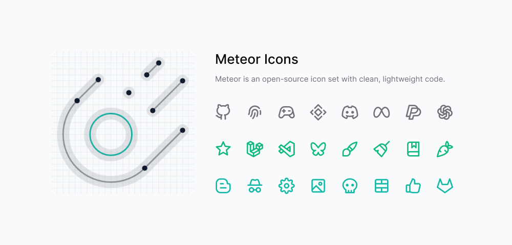
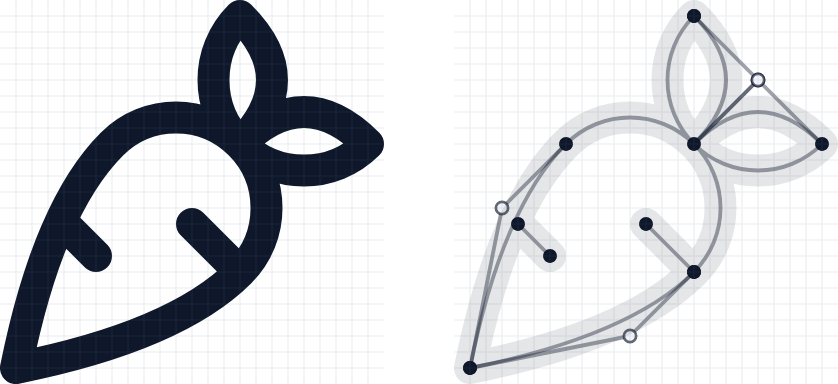

<p align="center">
  <a href="https://www.npmjs.com/package/meteor-icons"></a>
  <a href="https://www.npmjs.com/package/meteor-icons"></a>
  <a href="https://github.com/zkreations/meteor/blob/main/LICENSE"></a>
  <a href="https://www.npmjs.com/package/meteor-icons"></a>
</p>

<p align="center">
  <a href="https://meteoricons.com/"><strong>Browse icons at meteoricons.com →</strong></a>
</p>

---

## The problem with other icon libraries

Most icon sets are generated. An SVG tool exports a shape, an optimizer runs over it, and the result ships — clean enough, but not clean. Automated optimization has a hard ceiling: it can remove obvious redundancy, but it cannot reason about what a path is trying to draw.

The result is icon files that carry invisible weight: control points that could be anchor points, arcs expressed as Bézier curves, coordinates with six decimal places, path segments that could be a single straight line. No visual difference. Real overhead.



## Meteor takes a different approach

Every icon in this set is authored by hand at path level. That means looking at the SVG commands directly — not at the rendered shape — and asking whether each command is the best way to draw it. Sometimes an arc replaces four curves. Sometimes a coordinate simplifies to a round number. Sometimes two paths collapse into one.

The result is SVG code that could not be made smaller without changing what it draws.

**You can see this for yourself.** The [documentation site](https://meteoricons.com/) visualizes the skeleton of each icon — every anchor point, control handle, and path segment — so the structural decisions are visible, not just claimed.

## What this means in practice

- **Smaller bundle size.** Less path data means less to parse, transfer, and render. In an icon-heavy UI, this compounds.
- **Cleaner diffs.** Human-authored paths don't shift on every regeneration. The SVG source is stable.
- **Readable source.** The coordinates are intentional, not arbitrary floating-point artifacts. You can read a path and understand what it's doing.
- **Framework-ready.** Packages for Astro, React, Preact, Vue, SolidJS, and Svelte are generated from the same optimized source. The optimization carries through to every target.

## What's next

The icon set is live, but the work is ongoing. A few directions that are actively being pursued:

- **Deeper path audits.** Every icon already passes through manual review, but older icons in the set were designed before the current standard was fully established. These are being revisited one by one to bring them to the same level.
- **Visual consistency pass.** Optimization and consistency are sometimes in tension — a shape that is visually consistent with the rest of the set might require a less efficient path than one drawn in isolation. The goal is to resolve those trade-offs deliberately, not by defaulting to either extreme.
- **Expanded coverage.** New icons are added regularly, each held to the same authoring standard as the rest.
- **Tooling for contributors.** Making it easier for contributors to understand what "optimal" looks like in practice — better guidelines, reference examples, and possibly tooling to catch common inefficiencies before review.

## Packages

| Package | npm |
| --- | --- |
| [`packages/core`](./packages/core) | [`meteor-icons`](https://www.npmjs.com/package/meteor-icons) |
| [`packages/astro`](./packages/astro) | [`@meteor-icons/astro`](https://www.npmjs.com/package/@meteor-icons/astro) |
| [`packages/react`](./packages/react) | [`@meteor-icons/react`](https://www.npmjs.com/package/@meteor-icons/react) |
| [`packages/preact`](./packages/preact) | [`@meteor-icons/preact`](https://www.npmjs.com/package/@meteor-icons/preact) |
| [`packages/vue`](./packages/vue) | [`@meteor-icons/vue`](https://www.npmjs.com/package/@meteor-icons/vue) |
| [`packages/solid`](./packages/solid) | [`@meteor-icons/solid`](https://www.npmjs.com/package/@meteor-icons/solid) |
| [`packages/svelte`](./packages/svelte) | [`@meteor-icons/svelte`](https://www.npmjs.com/package/@meteor-icons/svelte) |

## Repository structure

```
icons/          SVG source files (one file per icon)
packages/       Published npm packages
  core/         Vanilla JS, browser bundle, sprite, and raw SVGs
  astro/        Astro components
  react/        React components
  preact/       Preact components
  vue/          Vue 3 components
  solid/        SolidJS components
  svelte/       Svelte components
build/          Code generation scripts
  core/         Shared utilities used by the generators
  generate-*.js One generator per package
docs/           Documentation site (meteoricons.com)
```

## Development

This repository uses [pnpm workspaces](https://pnpm.io/workspaces). Node.js >= 22.12.0 is required.

Install dependencies:

```sh
pnpm install
```

Build all packages from the SVG sources:

```sh
pnpm build
```

Run the documentation site locally:

```sh
pnpm docs:dev
```

Run the test suite:

```sh
pnpm test
```

## How the build works

1. `generate-svg.js` reads every `.svg` file in `icons/`, normalizes and optimizes it with SVGO, and writes `packages/core/exports/icons.json` — the canonical icon map that all other generators consume.
2. `generate-core.js` produces the vanilla JS package: ESM modules, browser bundle, SVG sprite, and Blogger includable.
3. Each `generate-<framework>.js` reads `icons.json` and emits the framework-specific component files under `packages/<framework>/src/`.
4. `generate-readme.js` writes a consistent `README.md` to each framework package from a single shared template.

## Contributing

All icons are designed by [Daniel Abel](https://twitter.com/danieI_abel). Contributions are welcome, but this project has a high bar for what ships: if a path can be shorter without changing the shape, it should be. Please read [CONTRIBUTING.md](./CONTRIBUTING.md) before submitting.

You can also support the project by [buying a coffee](https://ko-fi.com/zkreations) ☕.

## License

MIT — see [LICENSE](./LICENSE) for details.
