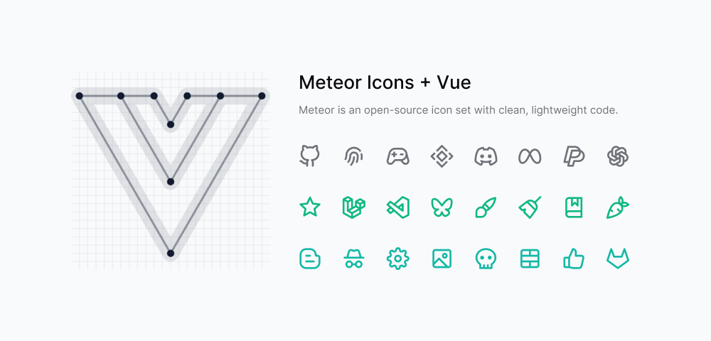

<p align="center">
  <a href="https://www.npmjs.com/package/@meteor-icons/vue"></a>
  <a href="https://www.npmjs.com/package/@meteor-icons/vue"></a>
  <a href="https://github.com/zkreations/meteor/blob/main/LICENSE"></a>
  <a href="https://www.npmjs.com/package/@meteor-icons/vue"></a>
</p>

<p align="center">
  <a href="https://meteoricons.com/"><strong>Browse at meteoricons.com →</strong></a>
</p>

## About

A lightweight, tree-shakeable icon library for Vue applications based on Meteor Icons.

## Features

- Tree-shakeable: import only what you use
- Designed for Vue
- Fully customizable through props
- Inline SVG rendering
- Optimized for performance

## Installation

```sh
npm install @meteor-icons/vue
```

## Usage

Use named imports for a compact developer experience.

```vue
<script setup>
import { Code, Star } from '@meteor-icons/vue'
</script>

<template>
  <Code />
</template>
```

You can also import by subpath if you prefer explicit per-file imports.

```js
import Code from '@meteor-icons/vue/icons/code'
```

Both styles are tree-shakeable in modern production bundlers.

## Props

All icons share the same props:

| Prop | Type | Default | Description |
| --- | --- | --- | --- |
| `size` | *string \| number* | 24 | Sets width and height |
| `color` | *string* | currentColor | Defines the stroke color |
| `strokeWidth` | *string \| number* | 2 | Controls stroke thickness |
| `class` | *string* | - | Additional CSS classes |
| `...attrs` | *HTML/SVG attrs* | - | Forwarded to the root SVG |

### Example

```vue
<script setup>
import { Code } from '@meteor-icons/vue'
</script>

<template>
  <Code size="48" color="red" :stroke-width="1" aria-label="code icon" />
</template>
```

## Best Practices

- Import only the icons you need
- Use currentColor to inherit color from parent elements
- Prefer CSS classes over inline styles for consistency

## Contributing

All icons are created by [Daniel Abel](https://twitter.com/danieI_abel), but contributions are welcome.

### Guidelines

- Ensure visual consistency across icons
- Keep SVG code clean and optimized
- Provide clear references when requesting new icons
- Contributions must be original work

## Support

If you want, you can also help me maintain this and more projects by [buying me a coffee](https://ko-fi.com/zkreations).

## License

Meteor Icons is licensed under the MIT License.
